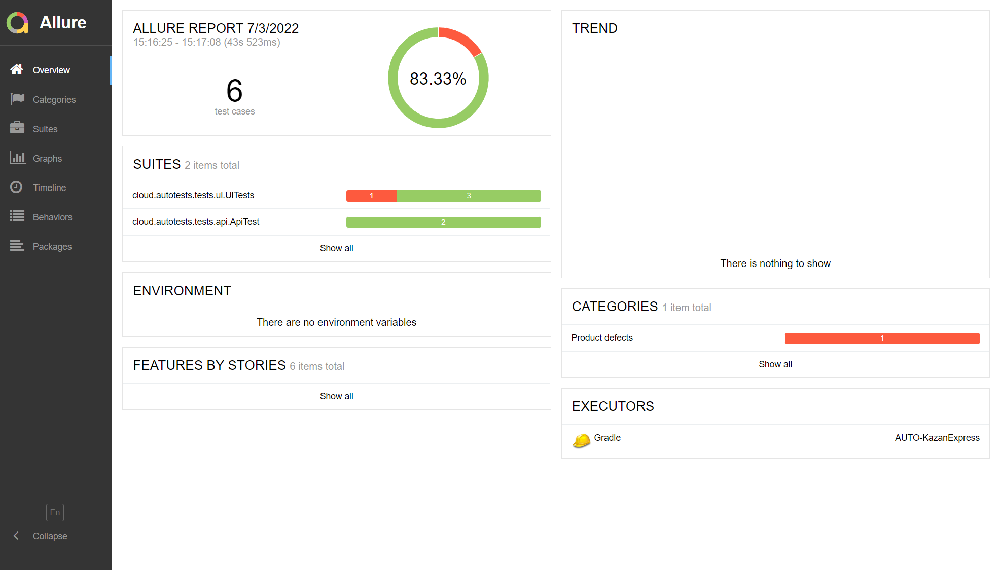
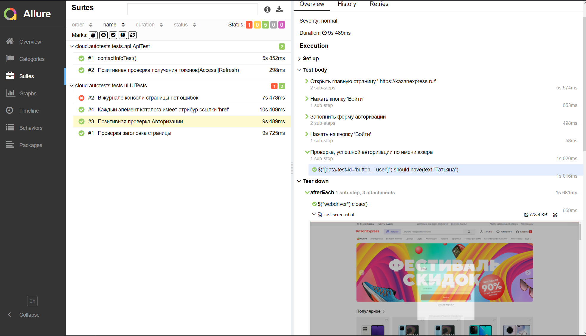
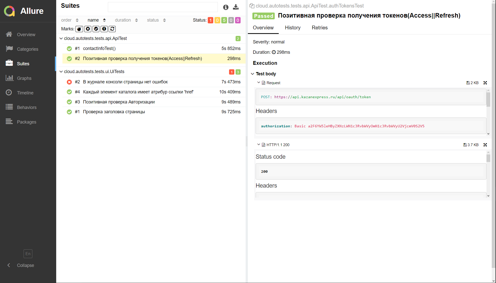
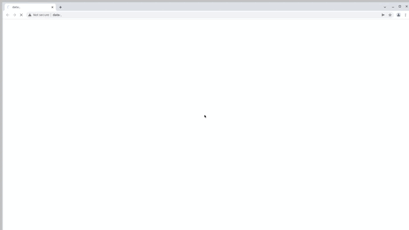
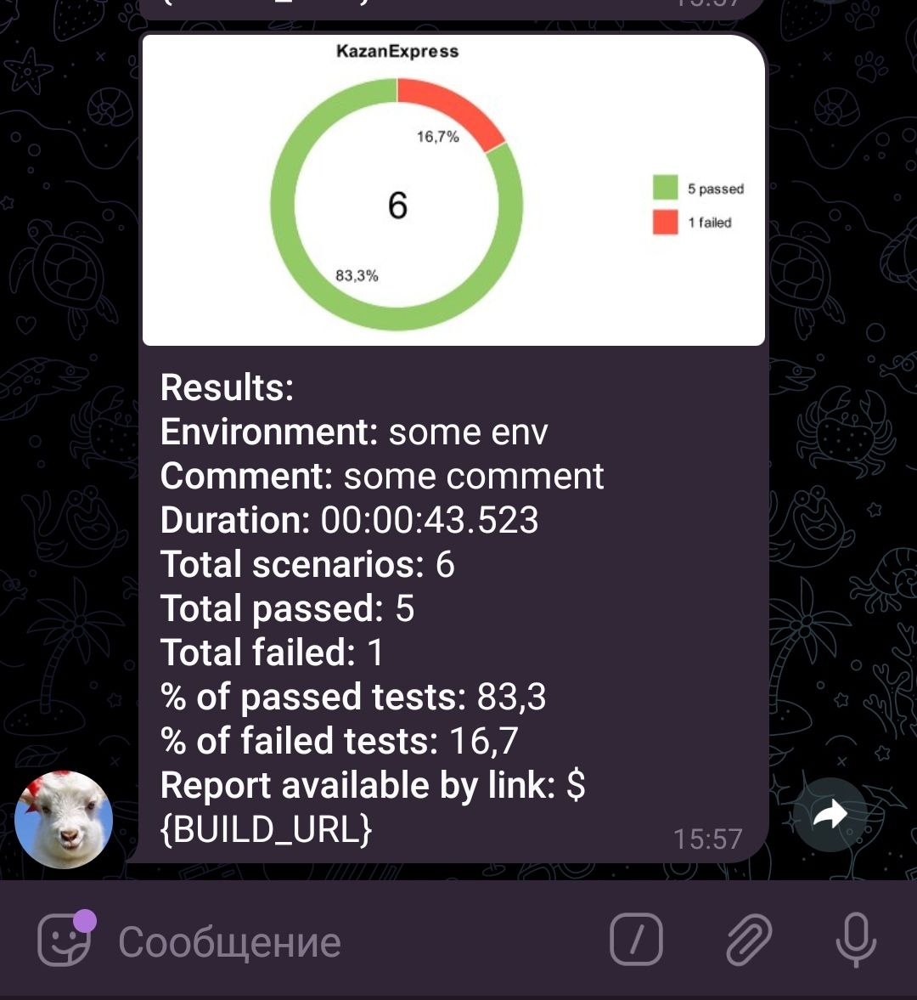

# Проект по автоматизации тестирования интернет-магазина KazanExpress"
<p align="center">

</p>
 <a target="_blank" href="https://kazanexpress.ru/">KazanExpress - интернет-магазин с бесплатной доставкой за 1 день</a>

## :floppy_disk: Содержание:
- <a href="#computer-технологии-и-инструменты">Технологии и инструменты</a>
- <a href="#notebook_with_decorative_cover-реализованные-проверки">Реализованные проверки</a>
- <a href="#arrow_forward-запуск-из-терминала">Запуск из терминала</a>
- <a href="#open_book-allure-отчет">Allure отчет</a>
- <a href="#robot-отчет-в-telegram">Отчет в Telegram</a>
- <a href="#film_projector-видео-примеры-прохождения-тестов">Видео примеры прохождения тестов</a>

## :computer: Технологии и инструменты
<p align="center">


</p>

## :notebook_with_decorative_cover: Реализованные проверки
- UI Tests:
  - Авторизация зарегестрированного пользователя
  - Соответствие заголовка страницы с желаемым результатом
  - В журнале консоли нет ошибок
  - Все элементы каталога имеют атрибут 'href'

- API Tests:
  - Проверка на получение токенов при авторизации зарегестрированного пользователя
  - Зарегистрированный пользователь имеет доступ к своим контактным данным 


## :arrow_forward: Запуск из терминала

```
gradle clean test
```

## :open_book: Allure отчет
- ### Главный экран отчета
<p align="center">

</p>

- ### Страница с проведенными тестами, где справа можно увидеть подробно-расписанные шаги, а внизу каждого тест-кейса прикрепляются аттачи
Отчет Ui-теста:
<p align="center">

</p>
Отчет Api-теста:
<p align="center">

</p>

## :robot: К каждому UI тесту прикрепляется аттч с видео
<p align="center">

</p>

## :robot: После прохождения тестов отправляется отчет в Telegram
<p align="center">

</p>


:heart: 
:blue_heart: 
